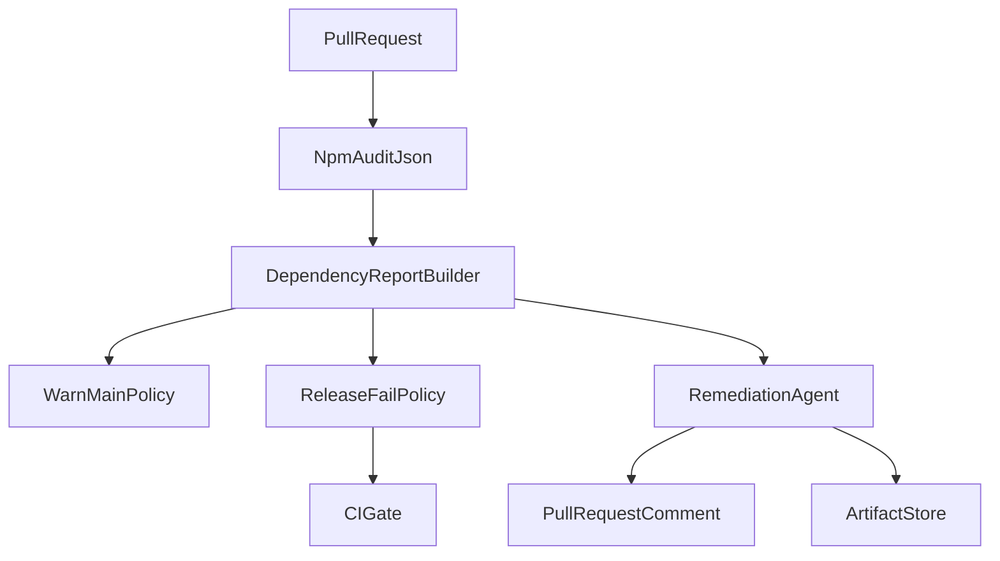

# Dependency Security Automation

## Objetivo
Agregar guardrails de supply chain en CI para detectar vulnerabilidades de dependencias de runtime y automatizar una propuesta de remediacion en cada PR.

## Componentes implementados
- Workflow:
  - `.github/workflows/dependency-security.yml`
- Script de reporte:
  - `scripts/dependency-audit-report.mjs`
- Scripts npm:
  - `npm run security:deps:audit` (salida humana)
  - `npm run security:deps:report`

## Politica de enforcement
- PR a `main`:
  - No bloquea merge.
  - Publica warning con resumen de findings runtime.
- PR a `release/*`:
  - Bloquea merge si existen findings runtime `high` o `critical`.

## Agente de remediacion (CI)
El job `ai-remediation-agent` realiza:
1. Descarga el reporte generado (`dependency-audit-report.json/.md`).
2. Publica/actualiza comentario en PR con resumen priorizado.
3. Sube artifacts del reporte para auditoria posterior.

## Flujo


## Ejecucion local
```bash
npm audit --omit=dev --json > audit-output.json || true
npm run security:deps:report
```

Esto genera:
- `dependency-audit-report.json`
- `dependency-audit-report.md`

## Recomendacion operativa
- No usar `npm audit fix --force` sobre ramas principales.
- Crear PRs dedicados de remediacion por lotes (critical/high primero).
- Ejecutar pruebas despues de cada lote de upgrades.
