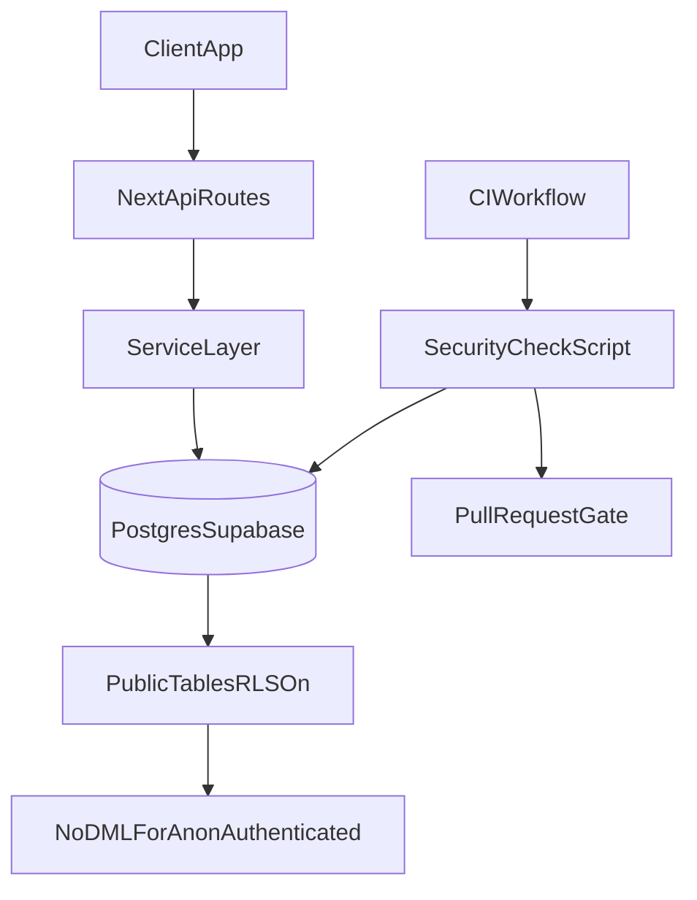

# Supabase RLS Remediation y Estructura Resultante

## Contexto del incidente
Supabase reporto el finding critico `rls_disabled_in_public` para `async-report` porque varias tablas de `public` estaban expuestas por PostgREST sin Row Level Security (RLS).

Tablas afectadas detectadas:
- `public._prisma_migrations`
- `public.Project`
- `public.User`
- `public.DailyReport`
- `public.ProjectUser`
- `public.AISummary`
- `public.Notification`
- `public.ApiKey`

## Causa raiz
- Prisma crea tablas en `public` por defecto.
- El esquema `public` esta expuesto por la Data API de Supabase.
- No se habilito RLS ni se revocaron grants de DML para `anon`/`authenticated`.

## Mitigacion aplicada
1. Se habilito RLS en todas las tablas afectadas.
2. Se revocaron permisos DML (`SELECT`, `INSERT`, `UPDATE`, `DELETE`) a `anon` y `authenticated`.
3. Se incluyo `public._prisma_migrations` en el hardening por tratarse de tabla interna.

Implementacion versionada:
- [`prisma/migrations/20260422120000_harden_public_rls/migration.sql`](../prisma/migrations/20260422120000_harden_public_rls/migration.sql)

## Validacion posterior
La verificacion se considera correcta cuando se cumple:
- No existe `rls_disabled_in_public` en Security Advisor.
- Todas las tablas de `public` requeridas por la app tienen `relrowsecurity = true`.
- Ninguna tabla de `public` conserva DML para `anon`/`authenticated`.

Nota: Es normal ver `rls_enabled_no_policy` como `INFO` mientras el acceso se realice backend-only y no se usen clientes Supabase en frontend para acceso directo a tablas.

## Modelo de acceso elegido (backend-only)
Para esta arquitectura, el acceso a datos se mantiene en backend:
- `app/api/**/route.ts` valida y autentica.
- `lib/services/**` ejecuta logica/DB.
- No hay DML directo desde clientes `anon`/`authenticated` a tablas de negocio.

## Estructura de seguridad resultante

## Automatizacion implementada
- Script de auditoria:
  - [`scripts/check-supabase-security.mjs`](../scripts/check-supabase-security.mjs)
  - Detecta:
    - tablas `public` con RLS deshabilitado
    - grants DML peligrosos para `anon`/`authenticated`
- Job de CI:
  - [`.github/workflows/supabase-security.yml`](../.github/workflows/supabase-security.yml)
  - Bloquea PR si el script falla.

## Variables necesarias para CI
- Secret recomendado en GitHub Actions:
  - `SUPABASE_DATABASE_URL`

## Procedimiento operativo para nuevas tablas
1. Crear migracion de esquema (Prisma).
2. En la misma iteracion, agregar hardening:
   - `ALTER TABLE ... ENABLE ROW LEVEL SECURITY`
   - `REVOKE ALL ... FROM anon, authenticated`
3. Ejecutar `npm run security:supabase`.
4. Revisar Security Advisor.
5. No aprobar PR hasta dejar checks en verde.

## Checklist rapido de release (DB security)
- RLS habilitado en cada tabla nueva de `public`.
- Sin grants DML a `anon`/`authenticated` salvo caso explicitamente aprobado.
- `_prisma_migrations` no expuesta.
- `npm run security:supabase` exitoso.
- Workflow `Supabase Security Guardrails` en verde.

## IA-augmented: recomendacion de mejora continua
Agregar un agente de pre-merge que:
- ejecute advisors de seguridad
- proponga SQL correctivo para findings detectados
- comente automaticamente en el PR con diff sugerido y nivel de riesgo

Este flujo reduce tiempo de remediacion y evita regresiones silenciosas en cambios de esquema.

## Controles complementarios de supply chain
Ademas del control de RLS/grants, se agrego una segunda capa para dependencias:
- Workflow: `.github/workflows/dependency-security.yml`
- Politica:
  - `main`: warning-only
  - `release/*`: fail en runtime `high/critical`
- Agente de remediacion:
  - publica comentario en PR con resumen priorizado
  - adjunta artifacts (`dependency-audit-report.json/.md`)

Esta separacion permite controlar seguridad de datos y de dependencias con puertas de CI independientes.
